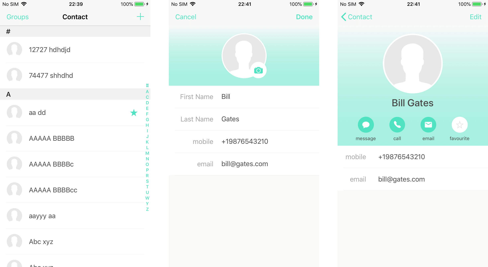
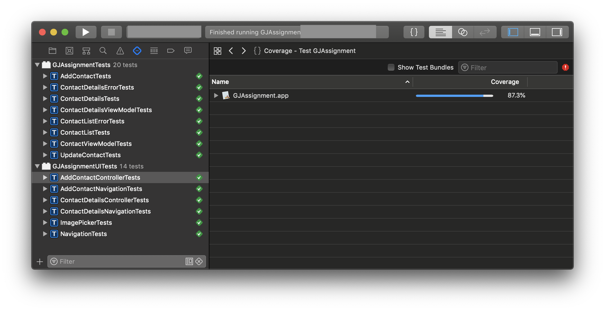
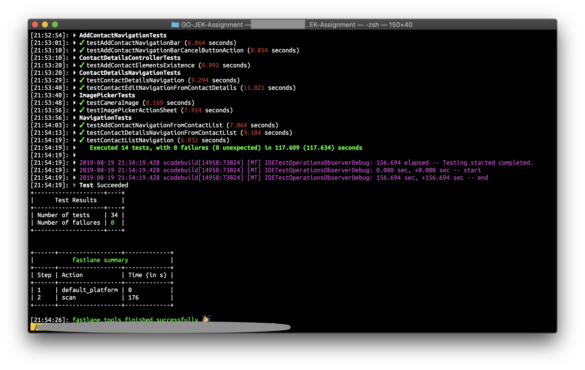
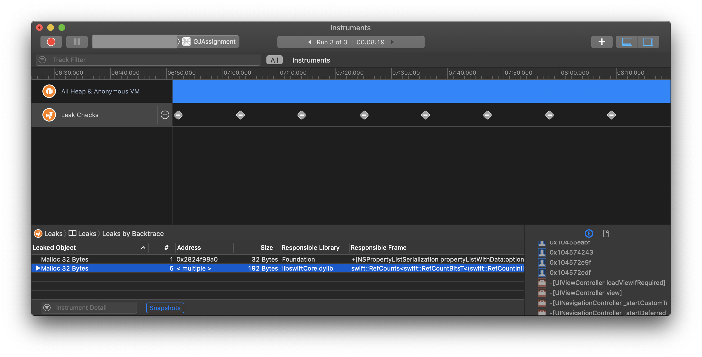

## 1. GO-JEK Assignment
GO-JEK Assignment by [Anonymous](mailto://).

## 2. Requirements
- iOS 11.0+
- [Xcode 10.3](https://download.developer.apple.com/Developer_Tools/Xcode_10.3/Xcode_10.3.xip) 
- [SwiftLint](https://github.com/realm/SwiftLint)
- [CocoaPods](https://cocoapods.org/)
- [Fastlane](https://fastlane.tools)(Optional)

## 3. Getting Start
- Open `GJAssignment.xcworkspace` in Xcode 10.3
- Build the project

## 4. Problem Statements
[Problem Statements](docs/ProblemStatement.pdf)

## 5. Swift
This project is build using Swift 5.

## 6. 3rd Party
- [MBProgressHUD](https://github.com/jdg/MBProgressHUD)

​This project only using MBProgressHUD 3rd party dependency. Because less 3rd party means higher selection chances. I added this 3rd party just to demonstrate the use of the dependency manager (cocoapods).

## 7. Unit and UI Test case
 - Total number of test cases - **`34`**
 - Unit test cases - **`20`**
 - UI test cases - **`14`**
 - Code coverage - **`87.3%`**

I'm not using any 3rd parting to mocking and stubs the objects. I build my own protocol based solution by creating fake `URLSession`.

## 8. Architecture
In this project, I'm using MVVM architecture without any Reactive 3rd party lib(like RxSwift etc.). For binding purposes, I'm using the custom binding class to bind properties and UI elements with ViewModels. These custom classes are available [here](GJAssignment/Utilities/Bindable).

## 9. Memory Management
After continually using the app for 8+ mins, the app only gets memory leaks of total 224 bytes. This process includes the interaction with other apps like message app, phone app and Camera (`UIImagePickerController`).

## 10. Extra Feature
I'm using CoreData to store contacts locally. Which means you can view contacts offline but with limited functionality. Like you can't add new contact or update existing.

## 11. Fastlane 
- `fastlane tests` - Runs all the tests
- `fastlane build` - Run all the tests and build
