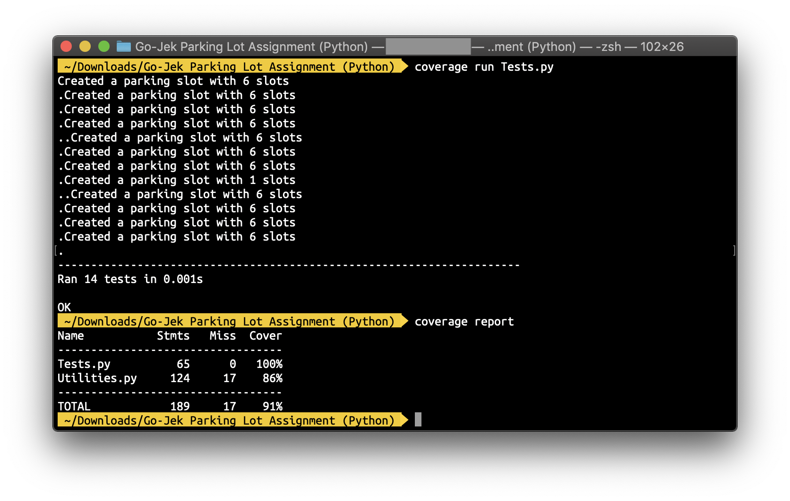

# Go-Jek Parking Lot Assignment (Python)

## 1. Problem Statment
Design a Parking lot which can hold `n` Cars. Every car been issued a ticket for a slot and the slot been assigned based on the nearest to the entry. The system should also return some queries such as:

- Registration numbers of all cars of a particular colour.
- Slot number in which a car with a given registration number is parked.
- Slot numbers of all slots where a car of a particular colour is parked.

## 2. Solution Approach
A car consist of Registration number, slot number and it's colour. Likewise our Parking Lot consist slots. For not making it too complicated, I choose a python dictionary for storing cars on slots and implemented the functionalities as accordingly.

## 3. Supported Commands

- `create_parking_lot` <`n`>   
To create a Parking lot. Where `n` is the size of the parking lot

- `park` <`registration_number`> <`colour`>   
To park the car in the parking lot and prints the allocated slot in the parking lot. Where `registration_number` is given registration number for the car and `colour` is given colour for the car

- `leave` <`slot`>   
To leave the parking lot from desired slot and prints the leaving slot. given slot number. Where `slot` is given sloat number

- `status`   
To check the status of Parking Lot

- `slot_numbers_for_cars_with_colour` <`colour`>   
To prints the registration number of the cars for the given colour. Where `color` is given colour

- `slot_number_for_registration_number` <`registration_number`>   
prints the slot number of the cars for the given number. Where `registration_number` is given registration number.

- `registration_numbers_for_cars_with_colour` <`colour`>   
To prints the slot number of the cars for the given colour.  Where `colour` is given colour.

## 4. Running Application
#### 4.1 Running the application in File mode:

```python
./ParkingLot.py input.txt
```

#### 4.2 Running the application in Interactive mode:

```python
./ParkingLot.py
```

## 5. Test Cases
- Total number of test cases - 14
- Code coverage - 86%

#### 5.1 For running the tests

```python
python Tests.py
```

#### 5.2 For calculating code coverage
```python
coverage run Tests.py 
coverage report
```


## 6. Running the application in a Docker Container

#### Build the image:

```python
docker build -t parkinglot:1.0 .
```

#### 6.1 Running the application in Interactive mode:

```python
docker run -it parkinglot:1.0 ./ParkingLot.py
```

#### 6.2 Running the application in File mode:

```python
docker run -it parkinglot:1.0 ./ParkingLot.py input.txt
```

## 7. Possible errors

When using running application in Docker, if it gives this error:

```bash
docker: Error response from daemon: OCI runtime create failed: container_linux.go:348: starting container process caused "exec: \"./ParkingLot.py\": permission denied": unknown.
```

just change the permissions by running

```bash
sudo chmod +x ./ParkingLot.py
```
